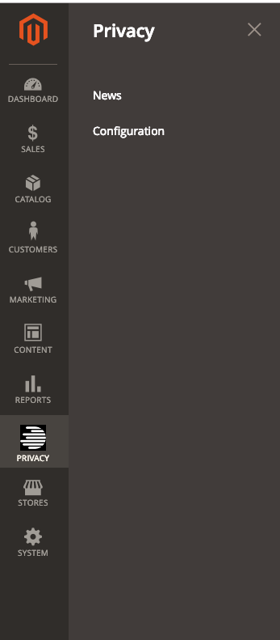
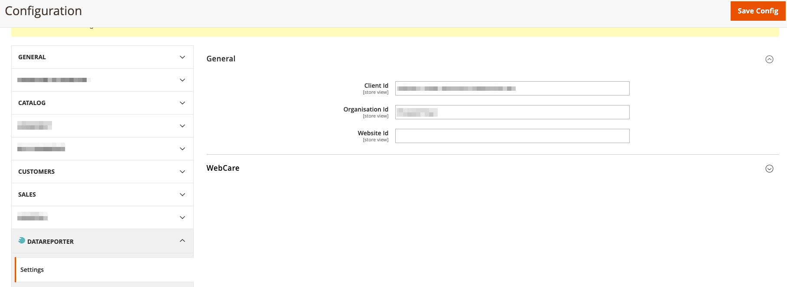

DataReporter Core Magento2 Module
============
 
 
 


Core Magento2 module containing base containers for config and news

Installation
------------

The easiest way to install the extension is to use [Composer](https://getcomposer.org/).

Run the following commands:

- ```$ composer require datareporter/module-core```
- ```$ bin/magento module:enable DataReporter_Core```
- ```$ bin/magento setup:upgrade && bin/magento setup:static-content:deploy```

Features
-------------

### News
Currently there is a link to the news posted by www.datareport.eu



### Account Configuration

See ```Privacy -> Configuration``` or ```Stores -> Configuration -> DataReporter -> Settings -> General```

* ClientId, OrganisationId, WebsiteId: These values are provided by DataReporter for your account



####Demo

Use following Demo-Credentials if you wanna try out the module, see ````Privacy -> Configuration````

* Client-Id: 33f002cc-2586-42b6-987d-548b2953c7b8
* Organisation-Id: R5spy6ZYDqA